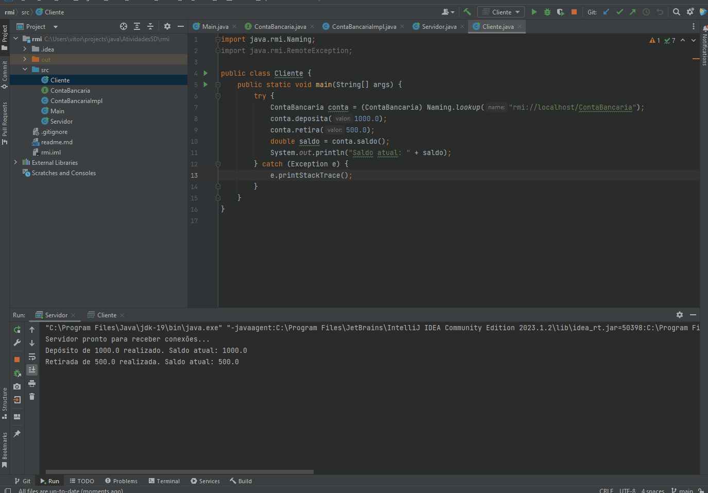

# Projeto RMI de Conta Bancária

## Resultado

Este projeto demonstra uma aplicação RMI (Remote Method Invocation) em Java, onde um objeto remoto representa uma conta bancária e vários clientes podem acessá-la. O objeto remoto implementa os métodos de depósito, retirada e saldo.

## Configuração do Ambiente

- JDK (Java Development Kit) instalado
- IDE Java (recomendado: IntelliJ IDEA, Eclipse, NetBeans)

## Como Executar o Projeto

1. Clone ou faça o download deste repositório para o seu ambiente local.
2. Abra o projeto na sua IDE Java preferida.
3. Execute o servidor:
    - Navegue até a classe `Servidor` e execute-a.
    - A mensagem "Servidor pronto para receber conexões..." será exibida no console.
4. Execute o cliente:
    - Navegue até a classe `Cliente` e execute-a.
    - O cliente realizará operações na conta bancária remota e exibirá o saldo resultante no console.

Certifique-se de executar o servidor antes de executar o cliente para que a comunicação RMI ocorra corretamente.

## Estrutura do Projeto

- `ContaBancaria.java`: Interface que define os métodos da conta bancária remota.
- `ContaBancariaImpl.java`: Implementação da interface `ContaBancaria`, representando a conta bancária real.
- `Servidor.java`: Classe responsável por iniciar o serviço RMI e registrar a instância da conta bancária para acesso remoto.
- `Cliente.java`: Classe para testar a aplicação, realizando operações na conta bancária remota.